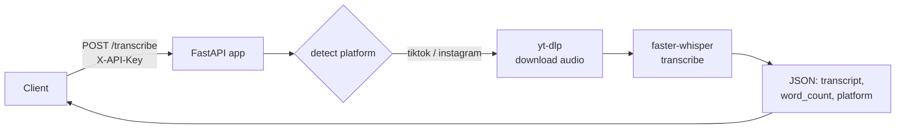

# Transcript API

**Paste a TikTok or Instagram video URL, get clean text back.** A small, self-hostable FastAPI service that downloads a short-form video and transcribes its audio locally with Whisper — no third-party transcription service, no per-minute fees.


---

## Architecture



## Endpoints

| Method | Path | Description |
|--------|------|-------------|
| `POST` | `/transcribe` | Body `{ "url": "..." }` → returns the transcript, platform, word count, and method |
| `GET` | `/health` | Liveness check → `{ "status": "ok" }` |

Auth is via the `X-API-Key` header (set the `API_KEY` env var in production; defaults to `dev` locally).

## Quick start

```bash
git clone https://github.com/nitesht2/transcript-api.git
cd transcript-api
pip install -r requirements.txt          # also needs ffmpeg + yt-dlp on PATH

API_KEY=mykey uvicorn main:app --host 0.0.0.0 --port 8000
```

Transcribe a video:

```bash
curl -X POST http://localhost:8000/transcribe \
  -H "X-API-Key: mykey" \
  -H "Content-Type: application/json" \
  -d '{"url": "https://www.tiktok.com/@user/video/123456789"}'
```

```json
{
  "url": "https://www.tiktok.com/@user/video/123456789",
  "platform": "tiktok",
  "transcript": "...",
  "word_count": 142,
  "method": "yt-dlp"
}
```

## Configuration

| Env var | Default | Notes |
|---------|---------|-------|
| `API_KEY` | `dev` | Required header value in production |
| `WHISPER_MODEL` | `base.en` | `tiny.en` for speed, `medium.en` for accuracy |

## Tech stack

FastAPI · Uvicorn · yt-dlp · faster-whisper · ffmpeg

Supported platforms: TikTok and Instagram (Reels / video posts).

## Deploy

`deploy.sh` provisions the service on a Linux VPS — installs system + Python dependencies and registers a `systemd` unit so the API runs persistently and restarts on failure:

```bash
ssh user@your-vps-ip
API_KEY=yourkey bash deploy.sh
```

## License

MIT
